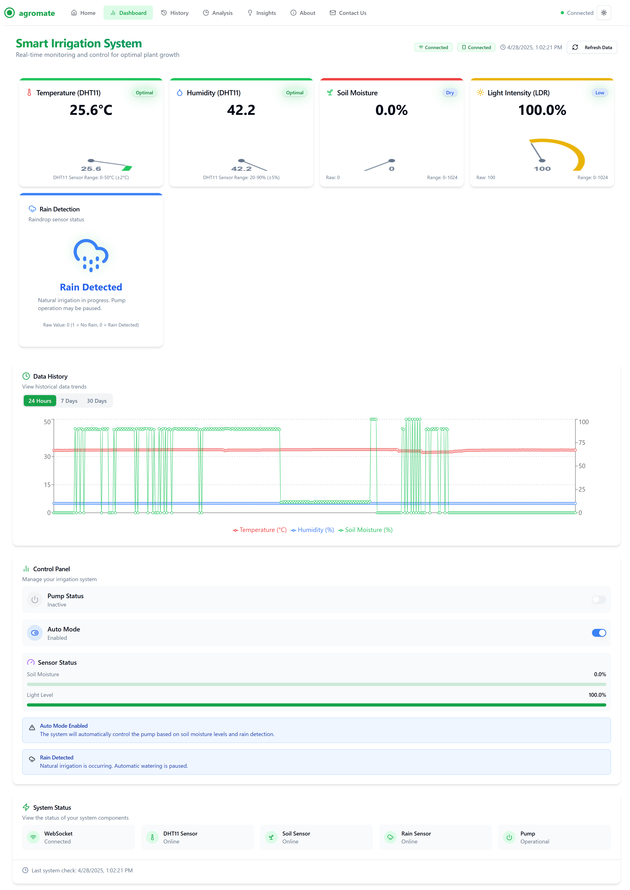

# 📁 Smart Irrigation System - Project Folder Structure and Full Roadmap

---

# 🌾 Smart Irrigation System with ESP8266

A **Smart Irrigation System** based on **ESP8266**, designed to monitor environmental conditions like **soil moisture**, **temperature**, **humidity**, **rain detection**, and **light intensity** (via LDR), and control a **water pump** automatically or manually via **WebSocket** communication.

This project ensures **efficient water usage**, **real-time monitoring**, and **automation** to support **smart farming** and **urban gardens**.


---

## 📋 Features
- **WiFi-Enabled Monitoring**: Connects to WiFi for live sensor data streaming.
- **WebSocket Communication**: Fast, real-time data transmission to a server/frontend.
- **NTP Time Synchronization**: Timestamps all sensor readings using India's Standard Time (IST, UTC+5:30).
- **Auto-Mode Pump Control**: Water pump is turned ON/OFF based on real-time soil, rain, temperature, and humidity conditions.
- **Light Detection (LDR)**: Measures surrounding light intensity.
- **Rain Sensor**: Detects rainfall.
- **DHT11 Sensor**: Monitors environmental **temperature** and **humidity**.
- **Error Handling**: Ensures data is sent only when values change or when first connecting.
- **Low Power**: Smart updates avoid unnecessary transmissions.
- **Reconnect Automatically**: Auto-reconnect to WebSocket server if disconnected.
- **Manual Override**: Auto-mode can be toggled via server commands.


---

# 🎯 Roadmap

| Phase | Description |
|------|-------------|
| Phase 1 | Setup ESP8266 firmware to send data over WebSocket |
| Phase 2 | Setup simple Node.js server to receive and display data |
| Phase 3 | Add Smart Decision Logic (control LED or Pump) |
| Phase 4 | (Optional) Build React Dashboard to visualize data |
| Phase 5 | (Optional) Save data to database (MongoDB) |
| Phase 6 | (Optional) Notifications and AI-based improvements |

---
## 1. Folder Structure

```bash
Smart-Irrigation-System/
├── client/                  # Frontend (Optional: Web Dashboard for Monitoring)
│   ├── public/              # Static assets
│   └── src/                 
│       ├── components/
│       │   └── sections/    # Reusable UI components
│       │       ├── dashboard-content.jsx
│       │       ├── dashboard-layout.jsx
│       │       ├── gauge.jsx
│       │       ├── history-chart.jsx
│       │       └── theme-toggle.jsx
│       ├── pages/           # Application pages (Dashboard, History, etc.)
│       ├── services/        # API calls and service logic
│       ├── App.jsx          # Main application component
│       └── main.jsx         # Application entry point
│
├── esp8266-firmware/         # ESP8266 Arduino firmware (sensors + irrigation logic)
│   ├── SmartIrrigation.ino   # Main microcontroller code
│   └── README.md             # Firmware-specific documentation
│
├── server/                   # Backend Server (Node.js + Express + WebSocket)
│   ├── controllers/          # Functions for handling sensor data logic
│   │   └── history-controller.js
│   ├── database/             # Database connection files
│   │   └── models/           # Database models (schemas for sensor readings, logs, etc.)
│   │       └── (models go here)
│   │   └── db.js             # Database connection script
│   ├── logs/                 # Server and WebSocket logs
│   ├── middlewares/          # Authentication, error handling, validations
│   │   └── save-history-data.js
│   ├── routes/               # API route definitions
│   │   └── history-route.js
│   ├── utils/                # Utility helper functions
│   │   └── logger.js
│   └── server.js             # Server entry point
│
├── README.md                 # Project Overview and Setup Instructions
├── LICENSE                   # (Optional) Open-source license information
└── .gitignore                # Files and folders to ignore in version control

```

---

## 2. What Goes Inside Each Part?

### 🔵 `client/`
- ReactJS / Vite frontend (Optional but very cool for live monitoring)
- Components like:
  - Live Data Display (Temperature, Soil Moisture, Light)
  - Status Indicator (Is LED ON or OFF)
- Responsive Web App to monitor field remotely.

### 🟡 `esp8266-firmware/`
- Your **ESP8266** code:
  - Connects to WiFi
  - Connects to WebSocket server
  - Reads sensors: DHT22, Soil Moisture, Rain Sensor, LDR
  - Applies logic: Temperature, Light, Moisture, Rain
  - Controls: Built-in LED or Relay Module for pump.

### 🟠 `server/`
- Node.js server
- Handles WebSocket connection with ESP8266
- Displays received data
- (Optional) Save to database for future analysis
- (Optional) Expose REST APIs if needed.

### 🟢 `database/`
- MongoDB or any database setup (optional but recommended)
- Can save history of sensor readings
- Analyze trends later (ex: which month was driest?).

---

## 📡 How it Works
1. ESP8266 connects to **WiFi**.
2. Synchronizes time using **NTP Client** (India timezone).
3. Connects to a **WebSocket Server** (IP & Port specified).
4. Continuously **reads sensor data**:
   - Temperature, Humidity, Soil Moisture, Rain Detection, Light Level.
5. **AutoMode logic**:
   - Turns ON the pump when:
     - Soil is dry **AND** (Temperature is high **OR** Humidity is low)
     - **AND** No Rain detected.
   - Turns OFF the pump otherwise.
6. Sends **sensor data** + **pump status** in real-time to the server.
7. If values change, or first-time connection happens, data is sent immediately.

---

## 🧠 AutoMode Conditions
- **Soil Dryness**: Soil moisture < 60%
- **High Temperature**: Temperature > 30°C
- **Low Humidity**: Humidity < 40%
- **No Rain**: Rain sensor not detecting rain

If these conditions match, pump (LED) turns **ON**, otherwise **OFF**.

---

## 🔧 Setup Instructions

1. **Flash ESP8266 with Code**  
   Upload the `.ino` sketch to your ESP8266 board via Arduino IDE or PlatformIO.
2. **Libraries Needed**:
   - `ESP8266WiFi.h`
   - `WebSocketsClient.h`
   - `ArduinoJson.h`
   - `DHT.h`
   - `WiFiUdp.h`
   - `NTPClient.h`
3. **Modify WiFi and WebSocket Settings**:
   ```cpp
   const char* ssid = "YOUR_WIFI_SSID";
   const char* password = "YOUR_WIFI_PASSWORD";

   const char* websocket_server = "SERVER_IP_ADDRESS";
   const uint16_t websocket_port = 3000;
   ```
4. **Connect Sensors Properly**:
   Follow pin mappings shown above carefully.
5. **Start Your WebSocket Server**:
   Ensure your server is running and listening to the right port and endpoint `/`.

---

## 📈 Data Sent to Server (JSON format)

```json
{
  "temperature": 29.5,
  "humidity": 60,
  "soilMoisture": 45,
  "lightLevel": 78,
  "rainDrop": 1,
  "pumpStatus": true,
  "autoMode": true,
  "timestamp": "2025-04-27T15:45:30+05:30",
  "espConnected": true
}
```
| Field         | Description                                |
|---------------|--------------------------------------------|
| temperature   | Measured in °C                             |
| humidity      | Relative Humidity (%)                      |
| soilMoisture  | Soil Moisture (%)                          |
| lightLevel    | Light intensity (%) from LDR               |
| rainDrop      | 0 = Rain detected, 1 = No rain             |
| pumpStatus    | true = Pump ON, false = Pump OFF            |
| autoMode      | true if auto mode is active                 |
| timestamp     | Time when reading was taken (ISO format)    |
| espConnected  | true if WebSocket connected                 |
## 3. Example README.md Structure

---

# 🌱 Smart Irrigation System using ESP8266

## 📋 Project Overview

This project implements a **Smart Irrigation System** that monitors:
- Temperature
- Humidity
- Light Intensity
- Soil Moisture
- Rain Detection

Based on environmental conditions, it automatically controls irrigation (water pump/LED). It also streams live data to a server using **WebSocket** technology.

---

## 🏛 Architecture
```text
[ ESP8266 + Sensors ]  --WebSocket-->  [ Node.js Server ]  --Optional--> [ Database ]
                                               |
                                               ↓
                                     [ React Web App (Client) ]
```

---

## ⚙️ Features
- 🌡️ Read real-time environmental data.
- 💧 Automatically decide when to water the plants.
- 🌦️ Rain detection to avoid unnecessary watering.
- 📶 WebSocket communication for fast, real-time data transfer.
- 📊 (Optional) Web dashboard for live monitoring.

---

## 🧩 Technology Stack

| Part              | Tech                   |
|-------------------|-------------------------|
| Microcontroller   | ESP8266 (NodeMCU)        |
| Sensors           | DHT22, Soil Moisture, LDR, Rain Sensor |
| Server            | Node.js + Express + WebSocket |
| Frontend (Optional) | React.js + TailwindCSS + Shadcn UI |
| Database (Optional) | MongoDB |

---

## 🚀 Setup Instructions

### 🖥️ Server
```bash
cd server
npm install
node server.js
```

### 📡 ESP8266 Firmware
- Open Arduino IDE
- Install libraries:
  - ESP8266WiFi
  - WebSocketsClient
  - DHT Sensor Library
- Upload `SmartIrrigation.ino`

### 🌐 Client (Optional)
```bash
cd client
npm install
npm run dev
```

---

## 🛠 Hardware Requirements
- ESP8266 NodeMCU board
- DHT22 Temperature and Humidity Sensor
- LDR (Light Dependent Resistor)
- Soil Moisture Sensor (Digital/Analog)
- Rain Detection Sensor
- (Optional) Relay Module + Motor/Pump
- Jumper wires, Breadboard

---
## 🔌 Hardware Required
| Component         | Quantity | Description                               |
|-------------------|----------|-------------------------------------------|
| ESP8266 (e.g., NodeMCU) | 1 | WiFi-enabled microcontroller |
| DHT11 Sensor       | 1        | Temperature and Humidity sensor           |
| Soil Moisture Sensor | 1      | For soil moisture measurement             |
| Rain Sensor Module | 1        | Detects rain presence                     |
| LDR (Light Dependent Resistor) | 1 | Measures ambient light               |
| Relay Module (optional) | 1  | To control real water pump safely         |
| Jumper wires       | As needed | For connections                        |
| Breadboard         | 1        | (Optional) prototyping                    |
| LED                | 1        | Simulates the pump action (Built-in LED)  |

---

## 🛠️ Pin Connections
| ESP8266 Pin | Connected To                   |
|-------------|---------------------------------|
| D6 (GPIO12)  | LDR Sensor Output (Digital)     |
| D4 (GPIO2)  | DHT11 Sensor Output (Digital)   |
| A0          | Soil Moisture Sensor (Analog)   |
| D5 (GPIO14) | Rain Sensor Output (Digital)    |
| LED_BUILTIN | Simulated Water Pump (LED)      |

> **Note**:  
> - **D3 (GPIO0)** used for LDR is set as **Input** (digital read).
> - **A0** reads analog voltage from Soil Moisture sensor.

---
## 📸 Project Images
(Insert images of your hardware setup, screenshots of dashboard)


---

## 📈 Future Improvements
- Mobile App for notifications.
- AI-based predictive irrigation (analyze historical data).
- Solar-powered version.

---


## 🖥️ Example Serial Output
```bash
Connected! IP Address: 192.168.1.105
Connected to WebSocket server
Frontend connected, sending immediate data...
Data Sent to Server
Data Sent to Server
Failed to read from DHT sensor!
Data Sent to Server
```

---

## ⚡ Troubleshooting
| Problem                          | Solution                                |
|-----------------------------------|-----------------------------------------|
| WebSocket not connecting          | Check IP address, port, server status   |
| ESP stuck during boot             | Avoid pulling GPIO0 LOW at startup (no pressed buttons on D3 pin) |
| DHT11 readings NaN (failed)        | Check wiring, DHT11 timing library      |
| No soil moisture readings         | Check if Soil Moisture sensor is powered correctly |
| Pump not switching ON/OFF         | Check your AutoMode conditions manually |

---

## 📚 Future Improvements
- Add **OTA updates** (Over the Air programming).
- Real **Relay Module** for controlling real water pump.
- Mobile App Notification using WebSocket messages.
- Solar powered battery management for outdoor deployment.

---

## ✨ Credits
> Developed by **Smitraj Bankar**  
> - B.Tech Computer Engineering | Sanjivani College of Engineering  
> - Expertise: MERN Stack, IoT Systems, Arduino, Embedded Projects

---

## 📄 License
This project is licensed under MIT License.


# ⚡ Bonus Tip:
You can use **ngrok** to make your local Node.js server public if you want to control the system over the internet 🌍.


---
# 🎯 Conclusion:

✅ This folder structure and plan will make your **Smart Irrigation System** ready for:
- Deployment
- Presentations
- College Projects
- Even Real-world Product Launch!
